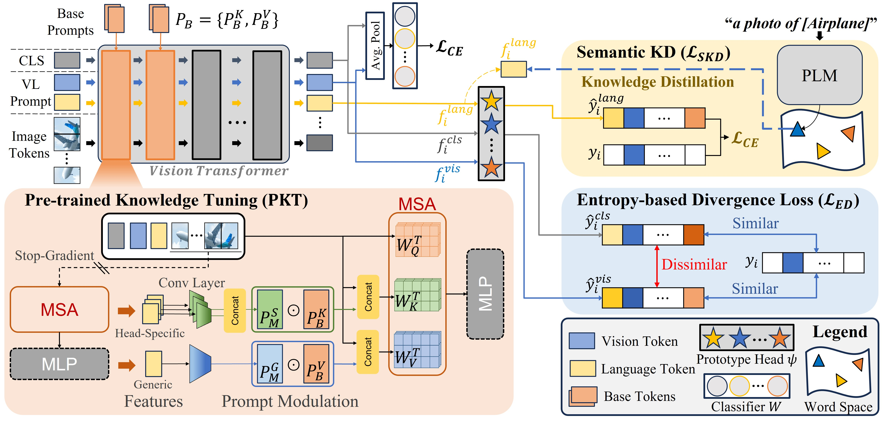

# [CVPR 2024] PriViLege: Pre-trained Vision and Language Transformers Are Few-Shot Incremental Learners

Official PyTorch implementation of PriViLege accepted by CVPR 2024: [Paper](https://arxiv.org/abs/2404.02117)

**PriViLege: Pre-trained Vision and Language Transformers Are Few-Shot Incremental Learners**  
Keon-Hee Park, Kyungwoo Song$\dagger$ , and Gyeong-Moon Park$\dagger$ 

## Abstract
Few-Shot Class Incremental Learning (FSCIL) is a task that requires a model to learn new classes incrementally without forgetting when only a few samples for each class are given. FSCIL encounters two significant challenges: catastrophic forgetting and overfitting, and these challenges have driven prior studies to primarily rely on shallow models, such as ResNet-18. Even though their limited capacity can mitigate both forgetting and overfitting issues, it leads to inadequate knowledge transfer during few-shot incremental sessions. In this paper, we argue that large models such as vision and language transformers pre-trained on large datasets can be excellent few-shot incremental learners. To this end, we propose a novel FSCIL framework called PriViLege, Pre-trained Vision and Language transformers with prompting functions and knowledge distillation. Our framework effectively addresses the challenges of catastrophic forgetting and overfitting in large models through new pre-trained knowledge tuning (PKT) and two losses: entropy-based divergence loss and semantic knowledge distillation loss. Experimental results show that the proposed PriViLege significantly outperforms the existing state-of-the-art methods with a large margin, e.g., +9.38% in CUB200, +20.58% in CIFAR-100, and +13.36% in miniImageNet.

## PriViLege

<!--  -->

## Run the PriViLege

    run_script/vit_run_pretrain.sh

## Requirements

    pip install requirements.txt

## Acknowledgements

Our project referenced the code of the following repositories.
We sincerely thanks to offering useful public code base.
-   [WaRP](https://github.com/EdwinKim3069/WaRP-CIFSL)
-   [FSCIL](https://github.com/xyutao/fscil)
